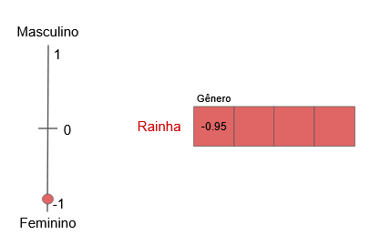
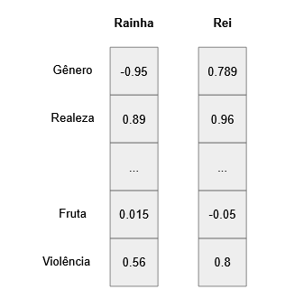
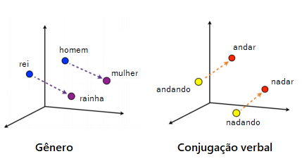
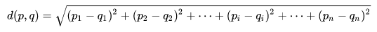

# O que é Word Embedding?

Word Embedding é uma técnica essencial em Processamento de Linguagem Natural (NLP) que permite representar palavras em um formato numérico, mais precisamente como vetores, para que sejam utilizadas em modelos estatísticos ou de deep learning. A ideia é atribuir a cada palavra um vetor multidimensional, no qual cada dimensão captura algum aspecto do significado da palavra.

Abordagens simples para essa transformação: Bag of Words e TF-IDF. Contudo, esses métodos têm limitações, como a necessidade de vetores com o mesmo tamanho do vocabulário e a incapacidade de capturar relações semânticas entre palavras.

A solução proposta pelo Word Embedding é construir um vetor para cada palavra, no qual cada dimensão representa uma informação específica sobre o significado da palavra. Por exemplo, uma palavra poderia ser representada por uma escala "Gênero", variando de -1 a 1, em que valores mais próximos de -1 indicariam uma conotação mais feminina e valores próximos de 1, uma conotação mais masculina. Outras dimensões adicionais poderiam ser incluídas para capturar outras nuances semânticas.

Em vez de atribuir manualmente esses valores para todas as palavras, o aprendizado de máquina entra em ação. O computador "aprende" os embeddings a partir do contexto em que as palavras aparecem nos dados de treinamento. Por exemplo, palavras frequentemente associadas a "rei" podem ser "rainha", "trono" e "coroa", o que resultaria em vetores similares para essas palavras.

Uma das abordagens mais populares para aprender os embeddings é o algoritmo Word2vec, que utiliza uma rede neural rasa com duas arquiteturas possíveis: CBOW e Skip-Gram. O CBOW prevê uma palavra com base em seu contexto, enquanto o Skip-Gram prevê o contexto com base em uma palavra. Essas tarefas são auto-supervisionadas, pois a rede aprende por meio do próprio corpus de texto, sem necessidade de rótulos externos.

A similaridade entre vetores de palavras pode ser medida de diversas formas, como a distância euclidiana e a similaridade de cossenos. A distância euclidiana indica o quão dissimilares são os vetores, enquanto a similaridade de cossenos mede o cosseno do ângulo entre os vetores, indicando quão similares eles são.

Além disso, é possível utilizar analogias para encontrar qual palavra está para palavra x, assim como a palavra y está para a w. Matematicamente, temos:
f(“mulher”) - f(“homem”) = f(p) - f(“rei”)
f(p) = f(“mulher”) - f(“homem”) + f(“rei”)

em que p é a palavra que queremos encotnrar

A avaliação dos embeddings pode ser feita de forma intrínseca, analisando analogias, similaridades e visualizações, ou extrínseca, verificando se eles melhoram o desempenho de modelos em tarefas específicas, como classificação de sentimentos em análise de reviews.

Em resumo, o Word Embedding é uma poderosa técnica para representar palavras em NLP, permitindo que modelos compreendam e explorem significados semânticos em texto de maneira mais eficiente.
